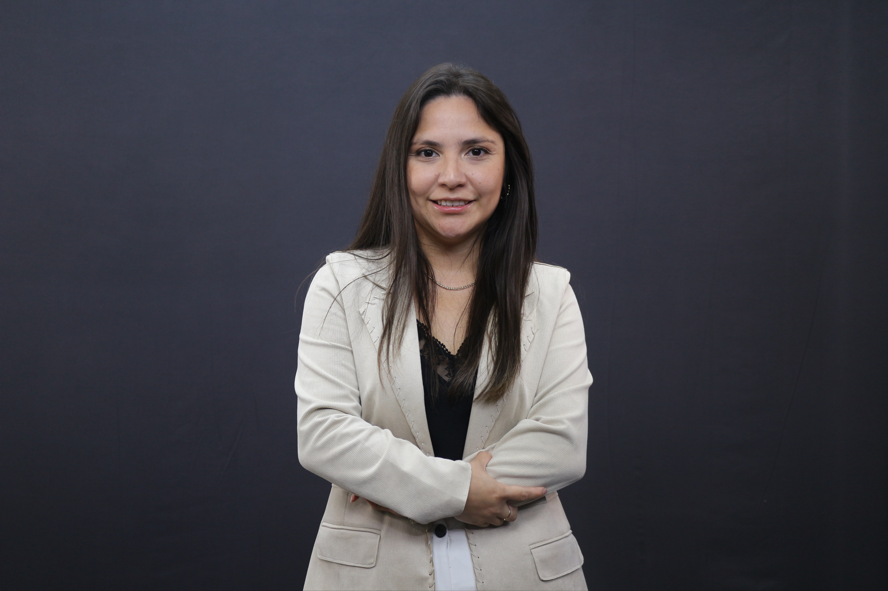

# 👩‍💻 Claudia Araya Medina  

**Ingeniera Civil Industrial | Máster en Planificación y Gestión de Procesos | Data Science Bootcamp**  

📍 Iquique, Chile · ✉️ [claudia.araya.medina.92@gmail.com](mailto:claudia.araya.medina.92@gmail.com) · 📱 +56 9 37767265  

---

## 🌟 Sobre mí  
Soy Ingeniera Civil Industrial con un Máster en Planificación y Gestión de Procesos. Tengo experiencia en **optimización de procesos, mejora continua y gestión de proyectos** en sectores mineros, industriales y académicos, tanto en Chile como en el extranjero.  

En mi trayectoria he trabajado en **transformación digital, análisis de datos, simulación y Business Intelligence**, aplicando herramientas como Python, R, Power BI y Tableau. Actualmente finalizo un **Bootcamp en Ciencia de Datos**, que me ha permitido reforzar competencias en **machine learning, modelado predictivo y visualización de datos**.  

---

## 🛠️ Habilidades Técnicas  
- **Lenguajes y herramientas:** Python, R, SQL, Power BI, Tableau, MS Project  
- **Machine Learning / AI:** Modelos predictivos, clasificación, clustering  
- **Procesos y gestión:** Lean Manufacturing, mejora continua, ERP SAP  
- **Otros:** Ciberseguridad, simulación de procesos, metodologías ágiles (Scrum, Design Thinking)  

---

## 📂 Proyectos Destacados  
Aquí encontrarás los proyectos consolidados de mi Bootcamp en Ciencia de Datos:  

1. 📖 [Sistema de Compras: "Libros & Bytes"](https://github.com/Claudia060392/Portafolio-Ciencia-de-Datos/blob/main/Practicas%20Consolidadas/M%C3%B3dulo_2.ipynb)  
2. 📈 [Migración de Datos - Limpieza y Transformación](https://github.com/Claudia060392/Portafolio-Ciencia-de-Datos/blob/main/Practicas%20Consolidadas/Modulo_3.ipynb)  
3. 🏅 [Análisis Olímpico - Rendimiento y Regresión](https://github.com/Claudia060392/Portafolio-Ciencia-de-Datos/blob/main/Practicas%20Consolidadas/Modulo_4.ipynb) 
4. 📉 [Efecto de Tutorías - Pruebas de Hipótesis](https://github.com/Claudia060392/Portafolio-Ciencia-de-Datos/blob/main/Practicas%20Consolidadas/Modulo_5.ipynb)  
5. 🏡 [Predicción de Precio de Viviendas - Machine Learning](https://github.com/Claudia060392/Portafolio-Ciencia-de-Datos/blob/main/Practicas%20Consolidadas/Modulo_6.ipynb) 
6. 🎵 [Clasificación de Géneros Musicales - Clustering & Análisis](https://github.com/Claudia060392/Portafolio-Ciencia-de-Datos/blob/main/Practicas%20Consolidadas/Modulo_7.ipynb) 
7. 🤖 [Predicción de Natalidad - Redes Neuronales](https://github.com/Claudia060392/Portafolio-Ciencia-de-Datos/blob/main/Practicas%20Consolidadas/Modulo_8.ipynb)  
8. 🌍 [Migraciones Globales - Big Data con PySpark](https://github.com/Claudia060392/Portafolio-Ciencia-de-Datos/blob/main/Practicas%20Consolidadas/Modulo_9.ipynb)

---

## 🌟 Gran Proyecto Final – Estrés y Bienestar Digital
Este es mi **proyecto integrador**, donde aplico todo lo aprendido en el bootcamp.  

📌 **Descripción breve:**  
El proyecto analiza un dataset de Kaggle sobre **uso de la tecnología y niveles de estrés**.  
- Se realiza un análisis exploratorio y estadístico de los datos.  
- Se diseñan y comparan **dos modelos de Machine Learning** (Regresión Lineal y Random Forest).  
- Se evalúa cuál modelo predice mejor el impacto de la tecnología en el bienestar.  
- Incluye conclusiones sobre los patrones encontrados y reflexiones finales.  

🔗 **Acceso al repositorio completo:**  
👉 [Gran Proyecto Final – Estrés y Bienestar Digital](https://github.com/Claudia060392/Analisis-Bienestar-Tecnologico)  

🎥 **Demo en video:**  
➡️ [Ver video explicativo](https://youtu.be/tu-video)

---

## 📄 CV y Página Personal  
Puedes ver mi CV completo y una versión en formato web aquí:  
👉 [Página web con CV](./index.html)  

---

## 🤝 Conecta conmigo  
- [LinkedIn](www.linkedin.com/in/claudiaarayam)  
- [GitHub](https://github.com/Claudia060392/Portafolio-Ciencia-de-Datos) 

---

## 🎥 Video Complementario  

  

✨ En este video hago una **breve presentación profesional** sobre mi perfil en ciencia de datos y algunos proyectos destacados.  

👉 Te invito a verlo para conocerme mejor.
